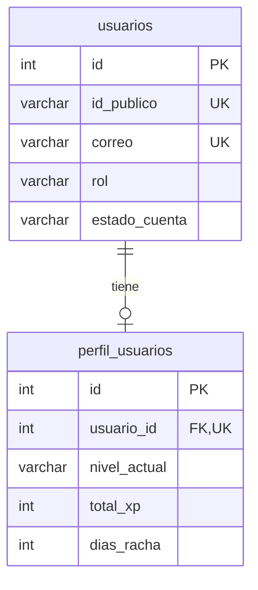

# 🗄️ Esquema de Base de Datos - SpeakLexi

## 📊 Información General

- **Motor:** MySQL 8.0+
- **Nombre de la Base de Datos:** `SpeakLexi`
- **Charset:** `utf8mb4`
- **Collation:** `utf8mb4_unicode_ci`
- **Motor de Almacenamiento:** InnoDB

---

## 📋 Tabla: `usuarios`

### Descripción
Tabla principal que almacena la información de autenticación y básica de todos los usuarios del sistema (alumnos, profesores, administradores y personal de mantenimiento).

### Estructura

| Columna | Tipo | Restricciones | Descripción |
|---------|------|---------------|-------------|
| `id` | `INT` | `PRIMARY KEY`, `AUTO_INCREMENT` | Identificador único interno |
| `id_publico` | `VARCHAR(20)` | `UNIQUE` | Identificador público para URLs y referencias externas |
| `nombre` | `VARCHAR(100)` | `NOT NULL` | Nombre del usuario |
| `primer_apellido` | `VARCHAR(100)` | `NOT NULL` | Primer apellido del usuario |
| `segundo_apellido` | `VARCHAR(100)` | `NULL` | Segundo apellido (opcional) |
| `correo` | `VARCHAR(255)` | `UNIQUE`, `NOT NULL` | Correo electrónico (usado para login) |
| `contrasena_hash` | `VARCHAR(255)` | `NOT NULL` | Contraseña hasheada con bcrypt |
| `rol` | `VARCHAR(50)` | `DEFAULT 'alumno'` | Rol del usuario: `alumno`, `profesor`, `admin`, `mantenimiento` |
| `correo_verificado` | `BOOLEAN` | `DEFAULT FALSE` | Indica si el correo fue verificado |
| `codigo_verificacion` | `VARCHAR(6)` | `NULL` | Código de 6 dígitos para verificar correo |
| `expira_verificacion` | `DATETIME` | `NULL` | Fecha de expiración del código de verificación |
| `token_recuperacion` | `VARCHAR(256)` | `UNIQUE`, `NULL` | Token JWT para recuperar contraseña |
| `expira_token_recuperacion` | `DATETIME` | `NULL` | Fecha de expiración del token de recuperación |
| `estado_cuenta` | `VARCHAR(20)` | `NOT NULL`, `DEFAULT 'activo'` | Estado: `activo`, `desactivado`, `suspendido` |
| `fecha_desactivacion` | `DATETIME` | `NULL` | Fecha cuando se desactivó la cuenta |
| `creado_en` | `DATETIME` | `DEFAULT CURRENT_TIMESTAMP` | Fecha de creación del registro |
| `actualizado_en` | `DATETIME` | `DEFAULT CURRENT_TIMESTAMP ON UPDATE CURRENT_TIMESTAMP` | Fecha de última actualización |

### Índices
```sql
PRIMARY KEY (id)
UNIQUE INDEX idx_usuarios_correo (correo)
UNIQUE INDEX idx_usuarios_id_publico (id_publico)
UNIQUE INDEX idx_usuarios_token_recuperacion (token_recuperacion)
INDEX idx_usuarios_rol (rol)
INDEX idx_usuarios_estado (estado_cuenta)
```

### Script SQL
```sql
CREATE TABLE usuarios (
  id INT AUTO_INCREMENT PRIMARY KEY,
  id_publico VARCHAR(20) UNIQUE,
  nombre VARCHAR(100) NOT NULL,
  primer_apellido VARCHAR(100) NOT NULL,
  segundo_apellido VARCHAR(100),
  correo VARCHAR(255) UNIQUE NOT NULL,
  contrasena_hash VARCHAR(255) NOT NULL,
  rol VARCHAR(50) DEFAULT 'alumno',
  correo_verificado BOOLEAN DEFAULT FALSE,
  codigo_verificacion VARCHAR(6),
  expira_verificacion DATETIME,
  token_recuperacion VARCHAR(256) UNIQUE,
  expira_token_recuperacion DATETIME,
  estado_cuenta VARCHAR(20) DEFAULT 'activo' NOT NULL,
  fecha_desactivacion DATETIME,
  creado_en DATETIME DEFAULT CURRENT_TIMESTAMP,
  actualizado_en DATETIME DEFAULT CURRENT_TIMESTAMP ON UPDATE CURRENT_TIMESTAMP
) ENGINE=InnoDB DEFAULT CHARSET=utf8mb4 COLLATE=utf8mb4_unicode_ci;
```

### Valores Permitidos

**`rol`:**
- `alumno` - Usuario que toma lecciones (por defecto)
- `profesor` - Usuario que puede ver estadísticas y dar retroalimentación
- `admin` - Administrador que gestiona contenido y usuarios
- `mantenimiento` - Personal de soporte técnico

**`estado_cuenta`:**
- `activo` - Cuenta funcional (por defecto)
- `desactivado` - Usuario desactivó su cuenta voluntariamente
- `suspendido` - Cuenta suspendida por el administrador

### Ejemplo de Registros
```sql
INSERT INTO usuarios (id_publico, nombre, primer_apellido, segundo_apellido, correo, contrasena_hash, rol) 
VALUES 
  ('USR001', 'Juan', 'Pérez', 'López', 'juan@example.com', '$2b$12$...', 'alumno'),
  ('USR002', 'María', 'García', 'Fernández', 'maria@example.com', '$2b$12$...', 'profesor'),
  ('USR003', 'Admin', 'Sistema', NULL, 'admin@speaklexi.com', '$2b$12$...', 'admin');
```

---

## 📋 Tabla: `perfil_usuarios`

### Descripción
Tabla que almacena información adicional del perfil del usuario, específicamente relacionada con su progreso de aprendizaje y gamificación.

### Estructura

| Columna | Tipo | Restricciones | Descripción |
|---------|------|---------------|-------------|
| `id` | `INT` | `PRIMARY KEY`, `AUTO_INCREMENT` | Identificador único del perfil |
| `usuario_id` | `INT` | `UNIQUE`, `FOREIGN KEY` | Referencia a `usuarios.id` |
| `nombre_completo` | `VARCHAR(255)` | `NOT NULL` | Nombre completo del usuario (calculado) |
| `id_publico` | `VARCHAR(20)` | `NULL` | Copia del ID público del usuario |
| `idioma` | `VARCHAR(100)` | `NULL` | Idioma que está aprendiendo (ej: "Inglés", "Francés") |
| `nivel_actual` | `VARCHAR(50)` | `NULL` | Nivel actual: `principiante`, `intermedio`, `avanzado` |
| `curso_actual` | `VARCHAR(100)` | `NULL` | Nombre del curso en el que está inscrito |
| `total_xp` | `INT` | `DEFAULT 0` | Puntos de experiencia acumulados |
| `dias_racha` | `INT` | `DEFAULT 0` | Días consecutivos de estudio |
| `ultima_actividad` | `DATE` | `NULL` | Fecha de última actividad del usuario |
| `creado_en` | `DATETIME` | `DEFAULT CURRENT_TIMESTAMP` | Fecha de creación del perfil |
| `actualizado_en` | `DATETIME` | `DEFAULT CURRENT_TIMESTAMP ON UPDATE CURRENT_TIMESTAMP` | Fecha de última actualización |

### Índices
```sql
PRIMARY KEY (id)
UNIQUE INDEX idx_perfil_usuario_id (usuario_id)
INDEX idx_perfil_nivel (nivel_actual)
INDEX idx_perfil_curso (curso_actual)
INDEX idx_perfil_racha (dias_racha)
FOREIGN KEY (usuario_id) REFERENCES usuarios(id) ON DELETE CASCADE
```

### Script SQL
```sql
CREATE TABLE perfil_usuarios (
  id INT AUTO_INCREMENT PRIMARY KEY,
  usuario_id INT UNIQUE,
  nombre_completo VARCHAR(255) NOT NULL,
  id_publico VARCHAR(20),
  idioma VARCHAR(100),
  nivel_actual VARCHAR(50),
  curso_actual VARCHAR(100),
  total_xp INT DEFAULT 0,
  dias_racha INT DEFAULT 0,
  ultima_actividad DATE,
  creado_en DATETIME DEFAULT CURRENT_TIMESTAMP,
  actualizado_en DATETIME DEFAULT CURRENT_TIMESTAMP ON UPDATE CURRENT_TIMESTAMP,
  FOREIGN KEY (usuario_id) REFERENCES usuarios(id) ON DELETE CASCADE
) ENGINE=InnoDB DEFAULT CHARSET=utf8mb4 COLLATE=utf8mb4_unicode_ci;
```

### Valores Permitidos

**`nivel_actual`:**
- `principiante` - Nivel básico
- `intermedio` - Nivel medio
- `avanzado` - Nivel avanzado

**`idioma`:**
- `Inglés`
- `Francés`
- `Alemán`
- `Italiano`
- `Portugués`
- (Otros idiomas según disponibilidad)

### Ejemplo de Registros
```sql
INSERT INTO perfil_usuarios (usuario_id, nombre_completo, id_publico, idioma, nivel_actual, curso_actual, total_xp, dias_racha) 
VALUES 
  (1, 'Juan Pérez López', 'USR001', 'Inglés', 'principiante', 'Inglés Básico', 250, 5),
  (2, 'María García Fernández', 'USR002', 'Francés', 'intermedio', 'Francés Intermedio', 1500, 30);
```

---

## 🔗 Relaciones entre Tablas


### Descripción de Relaciones

1. **usuarios → perfil_usuarios** (1:1)
   - Un usuario tiene un único perfil
   - El perfil se crea automáticamente al registrar un usuario
   - Si se elimina un usuario, su perfil se elimina automáticamente (`ON DELETE CASCADE`)

---

## 🔄 Triggers y Procedimientos

### Trigger: Crear Perfil al Registrar Usuario
```sql
DELIMITER $$

CREATE TRIGGER after_usuario_insert
AFTER INSERT ON usuarios
FOR EACH ROW
BEGIN
    INSERT INTO perfil_usuarios (
        usuario_id, 
        nombre_completo, 
        id_publico
    ) VALUES (
        NEW.id,
        CONCAT(NEW.nombre, ' ', NEW.primer_apellido, 
               IFNULL(CONCAT(' ', NEW.segundo_apellido), '')),
        NEW.id_publico
    );
END$$

DELIMITER ;
```

### Procedimiento: Actualizar Racha Diaria
```sql
DELIMITER $$

CREATE PROCEDURE actualizar_racha_usuario(IN p_usuario_id INT)
BEGIN
    DECLARE ultima_fecha DATE;
    
    SELECT ultima_actividad INTO ultima_fecha
    FROM perfil_usuarios
    WHERE usuario_id = p_usuario_id;
    
    IF ultima_fecha = CURDATE() - INTERVAL 1 DAY THEN
        -- Incrementar racha si estudió ayer
        UPDATE perfil_usuarios
        SET dias_racha = dias_racha + 1,
            ultima_actividad = CURDATE()
        WHERE usuario_id = p_usuario_id;
    ELSEIF ultima_fecha < CURDATE() - INTERVAL 1 DAY THEN
        -- Resetear racha si pasó más de un día
        UPDATE perfil_usuarios
        SET dias_racha = 1,
            ultima_actividad = CURDATE()
        WHERE usuario_id = p_usuario_id;
    END IF;
END$$

DELIMITER ;
```

---

## 📊 Queries Comunes

### 1. Obtener Usuario Completo con Perfil
```sql
SELECT 
    u.id,
    u.id_publico,
    u.nombre,
    u.primer_apellido,
    u.segundo_apellido,
    u.correo,
    u.rol,
    u.correo_verificado,
    u.estado_cuenta,
    p.nombre_completo,
    p.idioma,
    p.nivel_actual,
    p.curso_actual,
    p.total_xp,
    p.dias_racha,
    p.ultima_actividad
FROM usuarios u
LEFT JOIN perfil_usuarios p ON u.id = p.usuario_id
WHERE u.correo = 'juan@example.com';
```

### 2. Listar Usuarios Activos por Rol
```sql
SELECT 
    id_publico,
    nombre,
    primer_apellido,
    correo,
    rol,
    creado_en
FROM usuarios
WHERE estado_cuenta = 'activo' 
  AND rol = 'alumno'
ORDER BY creado_en DESC;
```

### 3. Top 10 Usuarios con Mayor Racha
```sql
SELECT 
    u.nombre,
    u.primer_apellido,
    p.dias_racha,
    p.total_xp,
    p.nivel_actual
FROM usuarios u
INNER JOIN perfil_usuarios p ON u.id = p.usuario_id
WHERE u.estado_cuenta = 'activo'
ORDER BY p.dias_racha DESC, p.total_xp DESC
LIMIT 10;
```

### 4. Verificar Código de Verificación
```sql
SELECT 
    id,
    correo,
    codigo_verificacion,
    expira_verificacion
FROM usuarios
WHERE correo = 'juan@example.com'
  AND codigo_verificacion = '123456'
  AND expira_verificacion > NOW()
  AND correo_verificado = FALSE;
```

### 5. Usuarios Registrados por Mes
```sql
SELECT 
    DATE_FORMAT(creado_en, '%Y-%m') AS mes,
    COUNT(*) AS total_usuarios,
    SUM(CASE WHEN rol = 'alumno' THEN 1 ELSE 0 END) AS alumnos,
    SUM(CASE WHEN rol = 'profesor' THEN 1 ELSE 0 END) AS profesores
FROM usuarios
GROUP BY mes
ORDER BY mes DESC;
```

### 6. Usuarios Inactivos (Sin Actividad en 30 días)
```sql
SELECT 
    u.id_publico,
    u.nombre,
    u.correo,
    p.ultima_actividad,
    DATEDIFF(CURDATE(), p.ultima_actividad) AS dias_inactivo
FROM usuarios u
INNER JOIN perfil_usuarios p ON u.id = p.usuario_id
WHERE p.ultima_actividad < CURDATE() - INTERVAL 30 DAY
  AND u.estado_cuenta = 'activo'
ORDER BY dias_inactivo DESC;
```

---

## 🔧 Mantenimiento

### Backup de Tablas
```sql
-- Backup completo
mysqldump -u root -p SpeakLexi usuarios perfil_usuarios > backup_usuarios_$(date +%Y%m%d).sql

-- Restaurar backup
mysql -u root -p SpeakLexi < backup_usuarios_20250127.sql
```

### Limpiar Códigos de Verificación Expirados
```sql
UPDATE usuarios
SET codigo_verificacion = NULL,
    expira_verificacion = NULL
WHERE expira_verificacion < NOW();
```

### Limpiar Tokens de Recuperación Expirados
```sql
UPDATE usuarios
SET token_recuperacion = NULL,
    expira_token_recuperacion = NULL
WHERE expira_token_recuperacion < NOW();
```

### Optimizar Tablas
```sql
OPTIMIZE TABLE usuarios;
OPTIMIZE TABLE perfil_usuarios;
```

---

## 📈 Estadísticas de la Base de Datos

### Consultar Tamaño de Tablas
```sql
SELECT 
    table_name AS 'Tabla',
    ROUND(((data_length + index_length) / 1024 / 1024), 2) AS 'Tamaño (MB)',
    table_rows AS 'Registros'
FROM information_schema.TABLES
WHERE table_schema = 'SpeakLexi'
ORDER BY (data_length + index_length) DESC;
```

---

## 🚀 Próximas Tablas (Módulos Pendientes)

### Módulo 2: Lecciones y Contenidos
```sql
-- lecciones
-- actividades
-- multimedia
-- progreso_lecciones
```

### Módulo 3: Gamificación
```sql
-- recompensas
-- logros
-- clasificacion (leaderboard)
```

### Módulo 4: Desempeño
```sql
-- estadisticas
-- retroalimentacion
-- planificacion
```

### Módulo 5: Mantenimiento
```sql
-- reportes_falla
-- tareas_mantenimiento
```

---

## 📝 Notas Importantes

### Seguridad
- **NUNCA** almacenar contraseñas en texto plano
- Siempre usar `contrasena_hash` con bcrypt
- Los tokens deben ser únicos y tener fecha de expiración
- Validar emails antes de enviar códigos de verificación

### Performance
- Los índices están optimizados para búsquedas frecuentes (correo, id_publico)
- Usar `EXPLAIN` para analizar queries lentas
- Considerar particionamiento si la tabla supera 1 millón de registros

### Integridad
- La relación usuarios → perfil_usuarios usa `ON DELETE CASCADE`
- Esto asegura que no queden perfiles huérfanos
- Siempre validar `usuario_id` antes de insertar en perfil

---

**Última Actualización:** 27 de Octubre 2025  
**Versión del Esquema:** 1.0.0  
**Módulo Actual:** Gestión de Usuarios ✅